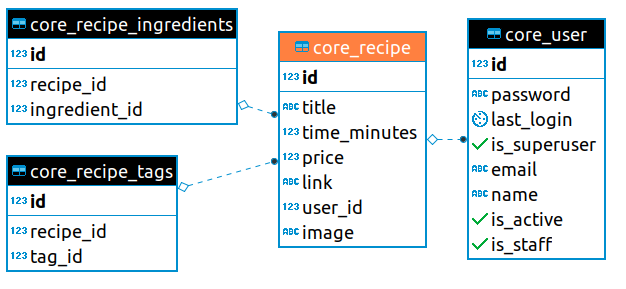

# djangorestframework-recipe

A showcase djangorestframework api for creating and finding recipes.

---

## Database visualised

The recipe table is central to the app and when finished, should look like this ERD

---

## Commit Steps

1. Simple docker install. Python container with Django and DRF

   To invoke, run `docker build .`

2. Create docker-compose app service and created an empty django app

   `docker-compose run app sh -c "django-admin.py startproject app."`

3. Add flake8 and Travis-CI configuration

4. Create `core` app with separate tests directory

5. Step 5. Configure Custom User Model to use email not username (plus some tests)
